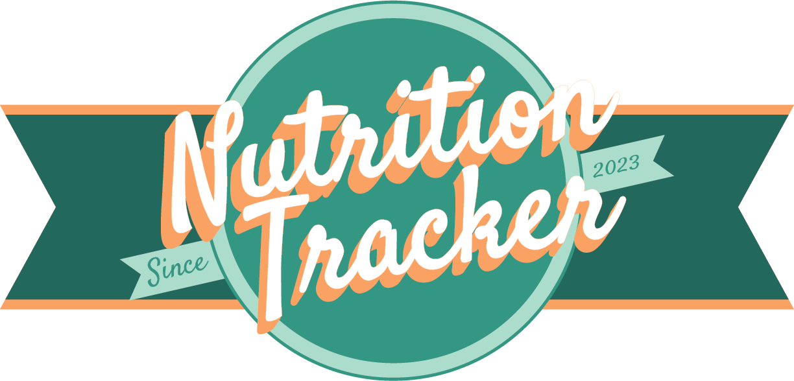
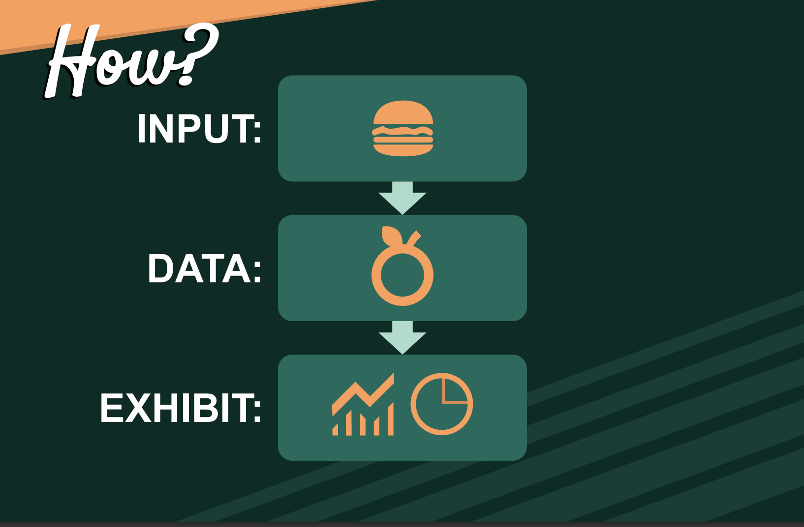

# Nutrition Tracker
https://sergrojas29.github.io/Nutrition-Tracker/

Group 5.5" created Nutrition Tracker as a heath tool that helps you monitor your calorie intake and other nutrients from the foods you eat. It can also help you set and achieve your health goals, such as losing weight, eating healthier, or managing a healthy life style.

Our main goal was to make it easy to input meal and have a visual and statistical display.
- Weekly meal tracker
    - Breakfast
    - Lunch
    - Dinner
 - Display Meal Nutritional information
 - Charts to convey a visual display
 - Detail Numerical account for each meal

## Authors

-[@Sergrojas29](https://github.com/Sergrojas29) | Sergio Rojas-Aguilar

-[@TSalamatin](https://github.com/TSalamatin) | Timothy Salamatin

-[@brendansikorjak](https://github.com/brendansikorjak) | Brendan Sikorjak

-[@svanly](https://github.com/svanly) | Svanly Narvaez

## API

| API | Type     | Description                |
| :-------- | :------- | :------------------------- |
| [Ninja API](https://calorieninjas.com/) | `data` | **Required API KEY** |
| [Chart.js](https://www.chartjs.org/) | `tool` | Used to create the charts|
| [Day.js](https://day.js.org/) | `tool` | Used to create the weekly tracker

## Development

## Usage

## Roadmap
    - Add Mobile Support
    - Personal Account through BMI input
    - Extra Meal (ie. snacks)
    - Monthly Tracking
    

## USER Story

AS AN USER I WANT TO MINDFUL ON WHAT I EAT 
I WANT TO INPUT WHAT I EAT INTO THE APP
SO THAT I CAN VIEW THE INCREDIENTS PROPORTIONAL TO THE ENTIRE FOOD

## ACCEPTANCE CRITERIA
GIVEN I AM TRACKING MY CALORIC INTAKE
WHEN INPUT MY RECIPE OR MEAL INGREDIENTS
THEN I AM PRESENTED WITH THE NUTRITIONAL INFORMATION

WHEN I SAVE MY MEAL INFORMATION
THEN I SAVE IT TO MY WEEKLY CALENDAR

WHEN I LOOK AT MY DALIY CALENDAR
THEN I AM PRESENTED WITH AMOUNT OF CALORIES FOR THAT DAY

WHEN THE WEEK IS DONE
THEN I CAN SEE MY CALORIC INTAKE CHARTED IN A GRAPH

WHEN I WANT TO REMOVE A MEAL FROM MY SCHEDULE
THEN I CAN REMOVE WITH A USER INTERFACE 

## License

[MIT](https://choosealicense.com/licenses/mit/)
